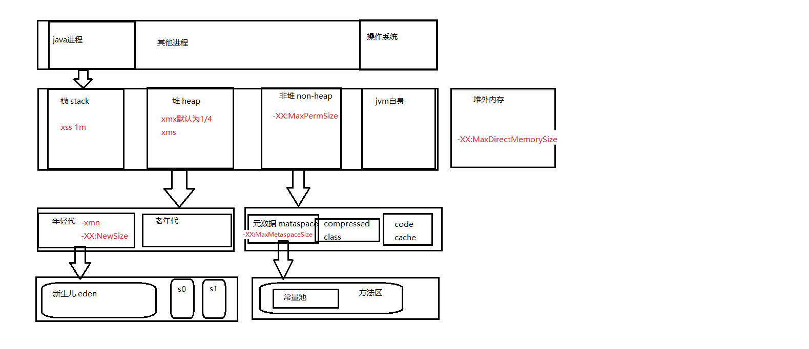
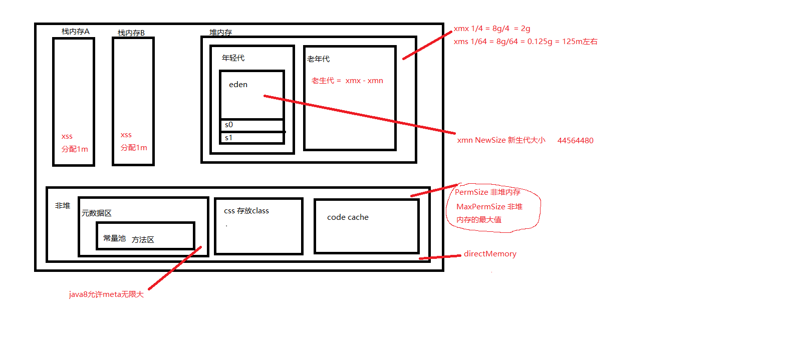

# 学习笔记

## 0.预习

查找jdk安装地址

```
jps -v

41488 Jps -Denv.class.path=.;D:\java\jdk8\lib\dt.jar;D:\java\jdk8\lib\tools.jar; -Dapplication.home=D:\java\jdk8 -Xms8m
```

## 1.课堂笔记

字节码、类加载器、虚拟机

### 字节码

- 字节码由单字节指令组成

指令性质分类：

- 栈操作，局部变量交互
- 流程
- 对象
- 算术和类型转换

### 原子操作：

 所谓原子操作是指不会被线程调度机制打断的操作；这种操作一旦开始，就一直运行到结束，中间不会有任何 context switch （切换到另一个线程） 

### jvm内存结构

- 堆：对象，对象有生命周期
- 栈：变量 ，使用完释放


## 2.字节码文件

- 生成字节码文件 

```
javap -c 指令查看
```

1. HelloWorld

```java
public class HelloWorld {
    public static void main(String[] args) {
        System.out.println("HelloWorld");
    }
}
```

字节码文件

```java
Compiled from "HelloWorld.java"
public class HelloWorld {
  public HelloWorld();
    Code:
       0: aload_0
       1: invokespecial #1                  // Method java/lang/Object."<init>":()V
       4: return

  public static void main(java.lang.String[]);
    Code:
       0: getstatic     #2                  // Field java/lang/System.out:Ljava/io/PrintStream;
       3: ldc           #3                  // String HelloWorld
       5: invokevirtual #4                  // Method java/io/PrintStream.println:(Ljava/lang/String;)V
       8: return
}

```

查看常量池信息

```
javap -c -verbose HelloWorld.class
```

```java
Classfile /F:/opt/geektime/Code1/src/HelloWorld.class
  Last modified 2020-10-23; size 411 bytes
  MD5 checksum f80888b354252323e21df10eba4ca5d7
  Compiled from "HelloWorld.java"
public class HelloWorld
  minor version: 0
  major version: 52
  flags: ACC_PUBLIC, ACC_SUPER
Constant pool:
   #1 = Methodref          #6.#15         // java/lang/Object."<init>":()V
   #2 = Fieldref           #16.#17        // java/lang/System.out:Ljava/io/PrintStream;
   #3 = String             #18            // HelloWorld	字符串常量
   #4 = Methodref          #19.#20        // java/io/PrintStream.println:(Ljava/lang/String;)V
   #5 = Class              #18            // HelloWorld
   #6 = Class              #21            // java/lang/Object
   #7 = Utf8               <init>
   #8 = Utf8               ()V
   #9 = Utf8               Code
  #10 = Utf8               LineNumberTable
  #11 = Utf8               main
  #12 = Utf8               ([Ljava/lang/String;)V
  #13 = Utf8               SourceFile
  #14 = Utf8               HelloWorld.java
  #15 = NameAndType        #7:#8          // "<init>":()V
  #16 = Class              #22            // java/lang/System
  #17 = NameAndType        #23:#24        // out:Ljava/io/PrintStream;
  #18 = Utf8               HelloWorld
  #19 = Class              #25            // java/io/PrintStream
  #20 = NameAndType        #26:#27        // println:(Ljava/lang/String;)V
  #21 = Utf8               java/lang/Object
  #22 = Utf8               java/lang/System
  #23 = Utf8               out
  #24 = Utf8               Ljava/io/PrintStream;
  #25 = Utf8               java/io/PrintStream
  #26 = Utf8               println
  #27 = Utf8               (Ljava/lang/String;)V
{
  public HelloWorld();
    descriptor: ()V
    flags: ACC_PUBLIC
    Code:
      stack=1, locals=1, args_size=1
         0: aload_0
         1: invokespecial #1                  // Method java/lang/Object."<init>":()V
         4: return
      LineNumberTable:
        line 7: 0

  public static void main(java.lang.String[]);
    descriptor: ([Ljava/lang/String;)V
    flags: ACC_PUBLIC, ACC_STATIC
    Code:
      stack=2, locals=1, args_size=1
         0: getstatic     #2                  // Field java/lang/System.out:Ljava/io/PrintStream;
         3: ldc           #3                  // String HelloWorld
         5: invokevirtual #4                  // Method java/io/PrintStream.println:(Ljava/lang/String;)V
         8: return
      LineNumberTable:
        line 9: 0
        line 10: 8
}
SourceFile: "HelloWorld.java"

```

2. HelloWorld

```java
public class HelloWorld {
    /**
     * 1.编译：执行 javac HelloWorld.java
     * 2.查看字节码文件 javap -c HelloWorld.class
     */
    public static void main(String[] args) {
        HelloWorld helloWorld = new HelloWorld();
    }
}

```

- 该字节码文件内容是

```java
Compiled from "HelloWorld.java"
public class HelloWorld {
    //反编译后的文件能看到有默认的无参构造
  public HelloWorld();	
    Code:
       0: aload_0
       1: invokespecial #1                  // Method java/lang/Object."<init>":()V
       4: return

  public static void main(java.lang.String[]);
    Code:
       0: new           #2                  // class HelloWorld
       3: dup
       4: invokespecial #3                  // Method "<init>":()V
       7: astore_1
       8: return
}
```

- 查看字节码文件的常量池信息 `javap -c -verbose`

```java
D:\项目\geektime\code1\src>javap -c -verbose HelloWorld.class
Classfile /D:/项目/geektime/code1/src/HelloWorld.class
  Last modified 2020-10-17; size 282 bytes
  MD5 checksum 77b7d944d407fbaa8b3d9767b006c158
  Compiled from "HelloWorld.java"
public class HelloWorld
  minor version: 0
  major version: 52
  flags: ACC_PUBLIC, ACC_SUPER //public类  调用super类方法
Constant pool:
   #1 = Methodref          #4.#13         // java/lang/Object."<init>":()V
   #2 = Class              #14            // HelloWorld
   #3 = Methodref          #2.#13         // HelloWorld."<init>":()V
   #4 = Class              #15            // java/lang/Object
   #5 = Utf8               <init>
   #6 = Utf8               ()V
   #7 = Utf8               Code
   #8 = Utf8               LineNumberTable
   #9 = Utf8               main
  #10 = Utf8               ([Ljava/lang/String;)V
  #11 = Utf8               SourceFile
  #12 = Utf8               HelloWorld.java
  #13 = NameAndType        #5:#6          // "<init>":()V
  #14 = Utf8               HelloWorld
  #15 = Utf8               java/lang/Object
{
  public HelloWorld();
    descriptor: ()V
    flags: ACC_PUBLIC
    Code:
    //栈深度，栈局部变量要保留的槽位
      stack=1, locals=1, args_size=1
         0: aload_0
         1: invokespecial #1                  // Method java/lang/Object."<init>":()V
         4: return
      LineNumberTable:
        line 7: 0

  public static void main(java.lang.String[]);
    //方法描述，(表示形参，[表示数组 L对象 后面的String是类名称 ，V表示返回时void类型
    descriptor: ([Ljava/lang/String;)V	
    // 访问标志，public static
    flags: ACC_PUBLIC, ACC_STATIC
    Code:
      stack=2, locals=2, args_size=1
         0: new           #2                  // class HelloWorld
         3: dup
         4: invokespecial #3                  // Method "<init>":()V
         7: astore_1
         8: return
      LineNumberTable:
        line 9: 0
        line 10: 8
}
SourceFile: "HelloWorld.java"

```

3. if + 运算

```java
public class MovingAverage {
    private int count = 0;
    private double sum = 0.0;

    public void submit(double value) {
        this.count++;
        this.sum += value;
    }

    public double getAvg() {
        if (0 == this.count) {
            return sum;
        }
        return this.sum / this.count;
    }

    public static void main(String[] args) {
        MovingAverage ma = new MovingAverage();
        int num1 = 1;
        int num2 = 2;
        ma.submit(num1);
        ma.submit(num2);
        double avg = ma.getAvg();
    }
}
```

```
编译含有中文
javac -encoding UTF-8 MovingAverage.java
```

```java
Compiled from "MovingAverage.java"
public class MovingAverage {
  public MovingAverage();
    Code:
       0: aload_0
       1: invokespecial #1                  // Method java/lang/Object."<init>":()V
       4: aload_0
       5: iconst_0
       6: putfield      #2                  // Field count:I
       9: aload_0
      10: dconst_0
      11: putfield      #3                  // Field sum:D
      14: return

  public void submit(double);
    Code:
       0: aload_0
       1: dup
       2: getfield      #2                  // Field count:I
       5: iconst_1
       6: iadd
       7: putfield      #2                  // Field count:I
      10: aload_0
      11: dup
      12: getfield      #3                  // Field sum:D
      15: dload_1
      16: dadd
      17: putfield      #3                  // Field sum:D
      20: return

  public double getAvg();
    Code:
       0: iconst_0
       1: aload_0
       2: getfield      #2                  // Field count:I
       5: if_icmpne     13
       8: aload_0
       9: getfield      #3                  // Field sum:D
      12: dreturn
      13: aload_0
      14: getfield      #3                  // Field sum:D
      17: aload_0
      18: getfield      #2                  // Field count:I
      21: i2d
      22: ddiv
      23: dreturn

  public static void main(java.lang.String[]);
    Code:
       0: new           #4                  // class MovingAverage
       3: dup
       4: invokespecial #5                  // Method "<init>":()V
       7: astore_1
       8: iconst_1
       9: istore_2
      10: iconst_2
      11: istore_3
      12: aload_1
      13: iload_2
      14: i2d
      15: invokevirtual #6                  // Method submit:(D)V
      18: aload_1
      19: iload_3
      20: i2d
      21: invokevirtual #6                  // Method submit:(D)V
      24: aload_1
      25: invokevirtual #7                  // Method getAvg:()D
      28: dstore        4
      30: return
}

```

## 3.线程栈和字节码执行模型

- jvm是一台基于栈的计算器，每个线程都有自己的线程栈，用于存储栈帧，
- 每次方法调用，jvm都会创建一个栈帧
- 栈帧由`操作数栈`，`局部变量数组`，`class引用`组成
- class引用指向当前方法在常量池中对应的class

#### 1.局部变量数组（局部变量表）

包含了方法参数，局部变量

局部变量数组在编译期确定大小

#### 2.动态计算demo

```java
public class Demo {
    public static void main(String[] args) {
        int a = 1;
        int b = 2;
        int c = (a + b) * 5;
    }
}
```

javap -c

```java
public static void main(java.lang.String[]);
    Code:
       0: iconst_1
       1: istore_1
       2: iconst_2
       3: istore_2
       4: iload_1
       5: iload_2
       6: iadd
       7: iconst_5
       8: imul
       9: istore_3
      10: return

```

- 0 将数字1加载到栈上
- 1 将1赋值给a存到本地变量表中
- 2 加载2 到栈上
- 3 将2赋值给b存到本地变量表中
- 4 加载数字1到栈
- 5 加载数字2到栈
- 6 在栈上计算两数之和为3
- 7 加载数字5到栈上
- 8 栈上计算 3 * 5
- 9 将栈上执行结果15存回到本地变量表中
- 10 返回

**注：之所以要从本地变量表再load会栈，是因为store指令会删除栈上的值**

#### 3.通过 verbose查看

```java
Classfile /D:/opt/JAVA-000/Week_01/code1/out/production/code1/com/vijayian/Demo.class
  Last modified 2021-2-4; size 446 bytes
  MD5 checksum 8bb4c41a12a4399c4ed6f35bc74b2dda
  Compiled from "Demo.java"
public class com.vijayian.Demo
  minor version: 0
  major version: 52
  flags: ACC_PUBLIC, ACC_SUPER
Constant pool:
   #1 = Methodref          #3.#21         // java/lang/Object."<init>":()V
   #2 = Class              #22            // com/vijayian/Demo
   #3 = Class              #23            // java/lang/Object
   #4 = Utf8               <init>
   #5 = Utf8               ()V
   #6 = Utf8               Code
   #7 = Utf8               LineNumberTable
   #8 = Utf8               LocalVariableTable
   #9 = Utf8               this
  #10 = Utf8               Lcom/vijayian/Demo;
  #11 = Utf8               main
  #12 = Utf8               ([Ljava/lang/String;)V
  #13 = Utf8               args
  #14 = Utf8               [Ljava/lang/String;
  #15 = Utf8               a
  #16 = Utf8               I
  #17 = Utf8               b
  #18 = Utf8               c
  #19 = Utf8               SourceFile
  #20 = Utf8               Demo.java
  #21 = NameAndType        #4:#5          // "<init>":()V
  #22 = Utf8               com/vijayian/Demo
  #23 = Utf8               java/lang/Object
{
  public com.vijayian.Demo();
    descriptor: ()V
    flags: ACC_PUBLIC
    Code:
      stack=1, locals=1, args_size=1
         0: aload_0
         1: invokespecial #1                  // Method java/lang/Object."<init>":()V
         4: return
      LineNumberTable:
        line 9: 0
      LocalVariableTable:
        Start  Length  Slot  Name   Signature
            0       5     0  this   Lcom/vijayian/Demo;

  public static void main(java.lang.String[]);
    descriptor: ([Ljava/lang/String;)V
    flags: ACC_PUBLIC, ACC_STATIC
    Code:
      stack=1, locals=4, args_size=1
         0: iconst_1
         1: istore_1
         2: iconst_2
         3: istore_2
         4: bipush        15
         6: istore_3
         7: return
      LineNumberTable:
        line 11: 0
        line 12: 2
        line 13: 4
        line 14: 7
       //本地变量表 args ,a,b,c
      LocalVariableTable:
        Start  Length  Slot  Name   Signature
            0       8     0  args   [Ljava/lang/String;
            2       6     1     a   I
            4       4     2     b   I
            7       1     3     c   I
}
SourceFile: "Demo.java"


```


## 4.类的生命周期

- 加载
  - 找class文件，找不到会抛出NoClassDefFound
  - jvm与类加载器（classLoader）协作完成

- 校验
- 准备
  - 创建静态字段，初始化为默认值，方法区中分配内存空间

- 解析
- 初始化
  - 首次主动使用初始化
  - 执行：
    - 类的构造方法
    - static静态赋值语句
    - static静态代码块
  - 子类初始化之前先对父类进行初始化
- 使用
- 卸载

## 5.类的加载时机

### 类的初始化触发：

- main方法所在类
- new对象的类
- 静态方法所在类
- 静态字段所在类
- 子类初始化会先初始化父类
- 接口定义了default方法，直接或者间接实现该接口的类初始化，会触发接口的初始化
- 反射api
- 初次调用MethodHandle实例

### 不会触发初始化：

- 子类引用父类的静态字段，只会触发父类的初始化，而不会触发子类的初始化
- 定义对象数组，不会触发该类的初始化
- 没有直接引用定义常量的类，不会触发定义常量所在的类
- 通过类名获取class对象，不会触发类的初始化
- 通过Class.forName加载指定类，如果指定参数initialize为false，也不会触发初始化
- 通过ClassLoader默认的loadClass方法，也不会触发初始化动作（加载，但是没有初始化）

## 6.类的加载机制

系统自带的类加载器

- 启动类加载器 BootstrapClassLoader
- 扩展类加载器 ExtClassLoader
- 应用类加载器 AppClassLoader

类加载机制的三个特点：

- 双亲委托：自定义的类加载器加载某个类的时候，会委托父类加载器去加载，一直往上找，如果都没找到则抛出ClassNotFoundException
- 负责依赖
- 缓存加载

## 7.java内存模型 JMM

Java Memory Model

- java内存模型定义了jvm如何使用内存，广义将内存模型分为两部分
  - jvm内存结构
  - JMM与线程规范

## 8.jvm内存结构



- 线程栈
- 堆内存

1. 如果是原生类型的局部变量，保存到栈，
2. 如果是对象，保存到堆，栈内存的是堆中对象的引用，类的静态变量和类定义一样保存到堆

3. 线程执行过程中，有多个方法调用栈，每执行到一个方法，就创建对应的栈帧，线程栈内有多个栈帧
4. 栈帧由（操作数栈，局部变量表，class引用组成<指明引用那个类的哪个方法，class在运行时常量池>）

堆：

1. 堆内存是所有线程共享的内存空间，jvm将heap分为年轻代和老年代，年轻代划分为新生代（伊甸区）和存活区，大部分的gc算法中存活区有s0和s1，总有一个区是空的，而且一般空间较小
2. 非堆本质上也是heap，只是一般不归GC管理，里面划分3个内存池，
   - metaspace，以前叫持久代，java8开始叫元数据区
   - ccs，存放class信息，和mataspace有交叉
   - code cache，存放JIT编译器编译的本地机器代码

## 9.JVM启动参数

- `-` 开头为标准参数，所有的JVM都要实现这些参数

- `-D` 设置系统属性

- `-X` 非标准参数，基本都是传给JVM的，可以使用 `java -X`命令查看当前JVM支持的非标准参数

  java 8 环境下执行，常用参数

```shell
	java -X
    -Xms<size>        设置初始 Java 堆大小
    -Xmx<size>        设置最大 Java 堆大小
    -Xss<size>        设置 Java 线程堆栈大小   
```

- `-XX` 控制JVM行为，跟具体的JVM实现有关，随时在下个版本取消
  - `-XX:+-Flags` +-是对布尔值进行开关
  - `-XX:key=value` 指定某个选项的值

### 内存配置

- `-Xmx` 指定最大堆内存，如-Xmx4g

- `-Xms` 指定堆空间的初始大小，如-Xms4g，服务器上将Xmx和Xms设置为一致，否则刚启动应用就会出现好几个fullgc，堆内存的扩容可能导致性能抖动（如果xms小，那么分到young区和old区的自然都小，young区满了，很快分到old，old很快满了，就会进行fullgc） **默认新生代：老年代 = 1：2**

- `-Xmn`  等价于-XX:NewSize 建议设置为Xmx的 1/2 - 1/4

- `-XX:MaxPermSize=size`, 这是JDK1.7之前使用的。Java8默认允许的Meta空间无限大，此参数无效

- `-XX:MaxMetaspaceSize=size`, Java8默认不限制Meta空间, 一般不允许设置该选项。 

- `-XX:MaxDirectMemorySize=size`，系统可以使用的最大堆外内存，这个参数跟-Dsun.nio.MaxDirectMemorySize效果相同。 

- `-Xss`, 设置每个线程栈的字节数。 例如 -Xss1m 指定线程栈为1MB，与- 

  XX:ThreadStackSize=1m等价

### GC配置

-XX:+UseG1GC：使用G1垃圾回收器 

-XX:+UseConcMarkSweepGC：使用CMS垃圾回收器 

-XX:+UseSerialGC：使用串行垃圾回收器 

-XX:+UseParallelGC：使用并行垃圾回收器 

-XX:+UnlockExperimentalVMOptions -XX:+UseZGC 

### 分析诊断参数


## 10.内存管理和垃圾回收

- 内存管理就是内存的生命周期管理，包括内存的申请、压缩、回收等

- java的内存管理是gc，jvm的gc模块不仅管理内存的回收，也负责内存的分配和压缩管理
- java的程序指令都是运行在jvm上的，程序需要分配和释放内存
- jvm在**`创建java对象`**的时候去分配新内存，并使用GC算法，根据对象的存活时间，在对象不使用之后，自动执行对象内存的垃圾回收

# GC

## 1.jdk内置命令行工具

- jps/jnfo  jps -lmv
- jstat -options
- jstat -gcutil pid 1000 1000 一秒执行1次 执行1000次
- 内存配置 jmap -heap pid
- jmap -histo pid 类占用空间

## 2.常用可视化工具

- jconsole
- jvisualVm
- visualGC(idea插件)
- jmc

## 3.GC的背景和一般原理

### 1.为什么会有GC

本质上内存是有限的，内存共享使用，手工申请，手工释放

### 2.GC方式

- 引用计数：有引用，则计数，但是有引用环会导致永远不会回收
- 标记清除算法：
  - marking: 遍历所有可达对象,并做标记
  - sweeping（清除）：不可达对象所占用的内存，在之后进行分配的时候内存可以重用

除了清除还要压缩，STW

### 3.并行GC和CMS 的基本原理

优势，可以处理循环依赖，只扫描部分对象

### 4.原理

- 对象分配在新生代的eden区，标记阶段Eden区的对象会`复制`到存活区，两个存活区的from 和to，互换角色，对象存活到一定周期会提升到老年代（由如下参数控制提升阈值  -XX:+MaxTenuringThreshold=15）

- 老年代默认都是存活对象，采用`移动`方式，

  1. 标记所有通过GC roots可达对象
  2. 删除所有不可达对象
  3. 整理老年代空间中的内容，方法是将所有存活对象复制，从老年代空间开始的地方依次存放

- 持久代/元数据区 

  1.8之前 -XX:MaxPermSize=256m 

  1.8之后 -XX:MaxMetaspaceSize=256m

- 可以作为GC roots的对象

  1. 当前正在执行的局部变量和输入参数
  2. 活动线程
  3. 所有类的静态变量 
  4. JNI引用

### 5.GC分类

#### 1.串行GC

serial GC 

- -XX:+UseSerialGC 配置串行 GC
- 串行 GC 对年轻代使用 mark-copy（标记-复制） 算法,对老年代使用 mark-sweep-compact （标记-清除-整理）算法
- 都是单线程GC，不能并行处理，会触发STW
- -XX:+USeParNewGC 改进版本的 Serial GC，可以配合 CMS 使用

**适用场景**

该选项只适合几百 MB 堆内存的 JVM（小堆），而且是单核 CPU 时比较有用

#### 2.并行GC

-XX：+UseParallelGC

-XX：+UseParallelOldGC 

-XX：+UseParallelGC -XX:+UseParallelOldGC

- 年轻代和老年代的垃圾回收都会触发 STW 事件。 在年轻代使用 标记-复制（mark-copy）算法，在老年代使用 标记-清除-整理（mark-sweep-compact）算法。
- -XX：ParallelGCThreads=N 来指定 GC 线程数， 其默认值为 CPU 核心数

**适用场景**：

并行垃圾收集器适用于多核服务器，主要目标是增加吞吐量。因为对系统资源的有效使用，能达到 

更高的吞吐量

#### 3.CMS GC

- -XX:+UseConcMarkSweepGC

- 其对年轻代采用并行 STW 方式的 mark-copy (标记-复制)算法，对老年代主要使用并发 mark-sweep (标记-清除)算法
- 不对老年代进行整理，而是使用空闲列表（free-lists）来管理内存空间的回收,维护空余的内存
- 在 mark-and-sweep （标记-清除） 阶段的大部分工作和应用线程一起并发执行

CMS执行的6个阶段

```powershell
PS C:\Users\Administrator> jmap -heap 12300
Attaching to process ID 12300, please wait...
Debugger attached successfully.
Server compiler detected.
JVM version is 25.191-b12

using parallel threads in the new generation.
using thread-local object allocation.
Concurrent Mark-Sweep GC

Heap Configuration:
   MinHeapFreeRatio         = 40
   MaxHeapFreeRatio         = 70
   MaxHeapSize              = 2132803584 (2034.0MB)
   NewSize                  = 44695552 (42.625MB)
   MaxNewSize               = 523436032 (499.1875MB)
   OldSize                  = 89522176 (85.375MB)
   NewRatio                 = 2
   SurvivorRatio            = 8
   MetaspaceSize            = 21807104 (20.796875MB)
   CompressedClassSpaceSize = 1073741824 (1024.0MB)
   MaxMetaspaceSize         = 17592186044415 MB
   G1HeapRegionSize         = 0 (0.0MB)
Heap Usage:
New Generation (Eden + 1 Survivor Space):
   capacity = 40239104 (38.375MB)
   used     = 30660064 (29.239715576171875MB)
   76.19469856982899% used
Eden Space:
   capacity = 35782656 (34.125MB)
   used     = 26655040 (25.42022705078125MB)
   free     = 9127616 (8.70477294921875MB)
   74.49150784111721% used
From Space:
   capacity = 4456448 (4.25MB)	
   used     = 4005024 (3.819488525390625MB)
   free     = 451424 (0.430511474609375MB)
   89.87031824448529% used
To Space:
   capacity = 4456448 (4.25MB)
   used     = 0 (0.0MB)
   free     = 4456448 (4.25MB)
   0.0% used
concurrent mark-sweep generation:
   capacity = 89522176 (85.375MB)
   used     = 18628936 (17.76593780517578MB)
   free     = 70893240 (67.60906219482422MB)
   20.80929757560853% used

16057 interned Strings occupying 2178392 bytes.
```

6,7,8 并行 gc效率高，吞吐量高

9以上 G1

CMS老年代，parnew新生代 （短延迟）

#### 4.G1 GC

- -XX:+UseG1GC：启用G1 GC； 

使用场景：

内存堆较大，gc的时间可控

## 作业

 **1.（选做）**自己写一个简单的 Hello.java，里面需要涉及基本类型，四则运行，if 和 for，然后自己分析一下对应的字节码，有问题群里讨论。 

java文件

```
public class HelloWorld {
    public static void main(String[] args) {
        int a = 1;
        int b = 2;
        int c = a + b;
        for (int i = 0; i < 10; i++) {
            int temp;
            if (i < c) {
                temp = c - i;
            } else {
                temp = c * i;
            }
            System.out.println(temp);
        }
    }
}
```

编译class文件

```java
public class HelloWorld {
    public HelloWorld() {
    }

    public static void main(String[] var0) {
        byte var1 = 1;
        byte var2 = 2;
        int var3 = var1 + var2;

        for(int var4 = 0; var4 < 10; ++var4) {
            int var5;
            if (var4 < var3) {
                var5 = var3 - var4;
            } else {
                var5 = var3 * var4;
            }

            System.out.println(var5);
        }

    }
}
```

javap 字节码文件

```java
Compiled from "HelloWorld.java"
public class homework.HelloWorld {
  public homework.HelloWorld();
    Code:
       0: aload_0
       1: invokespecial #1                  // Method java/lang/Object."<init>":()V
       4: return

  public static void main(java.lang.String[]);
    Code:
       0: iconst_1
       1: istore_1
       2: iconst_2
       3: istore_2
       4: iload_1
       5: iload_2
       6: iadd
       7: istore_3
       8: iconst_0
       9: istore        4
      11: iload         4
      13: bipush        10
      15: if_icmpge     53
      18: iload         4
      20: iload_3
      21: if_icmpge     33
      24: iload_3
      25: iload         4
      27: isub
      28: istore        5
      30: goto          39
      33: iload_3
      34: iload         4
      36: imul
      37: istore        5
      39: getstatic     #2                  // Field java/lang/System.out:Ljava/io/PrintStream;
      42: iload         5
      44: invokevirtual #3                  // Method java/io/PrintStream.println:(I)V
      47: iinc          4, 1
      50: goto          11
      53: return
}
```

**2.（必做）**自定义一个 Classloader，加载一个 Hello.xlass 文件，执行 hello 方法，此文件内容是一个 Hello.class 文件所有字节（x=255-x）处理后的文件。文件群里提供。

```
自定义HelloClassLoader继承ClassLoader，重写findClass方法，使用defineClass方法加载内存中的class字节数组
```

3.**（必做）**画一张图，展示 Xmx、Xms、Xmn、Meta、DirectMemory、Xss 这些内存参数的关系。



**4.（选做）**检查一下自己维护的业务系统的 JVM 参数配置，用 jstat 和 jstack、jmap 查看一下详情，并且自己独立分析一下大概情况，思考有没有不合理的地方，如何改进。


