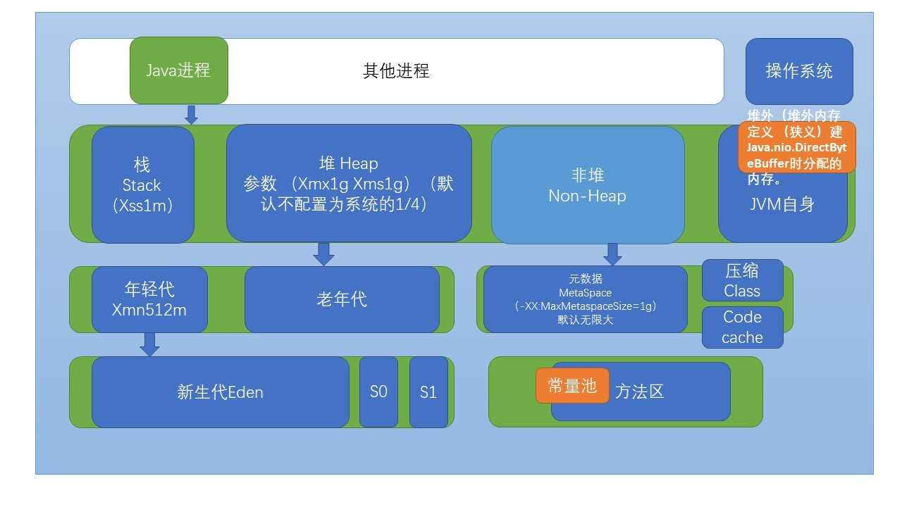

# 知识体系回顾总结

[TOC]

## 内存泄漏和内存溢出

内存溢出 out of memory，是指程序在申请内存时，没有足够的内存空间供其使用，出现out of memory；比如申请了一个integer,但给它存了long才能存下的数，那就是内存溢出。

内存泄露 memory leak，是指程序在申请内存后，无法释放已申请的内存空间，一次内存泄露危害可以忽略，但内存泄露堆积后果很严重，无论多少内存,迟早会被占光。

# 1.Jvm基础知识

- Java是一种面向对象、静态类型、编译执行、有VM/GC和运行时、跨平台的高级语言
- Java二进制文件跨平台
- 兼容性好：低版本编译的jar包，放到高版本运行没有问题
- java生态好，解决方案多

## 2.Java字节码技术

字节码、类加载器、虚拟机

### 1.HelloWorld.java如何加载的？

- 生成字节码文件
- 虚拟机从文件系统中加载（通过类加载器加载）字节码文件，生成一个类，放到内存

### 2.字节码

Java bytecode由单字节（byte）的指令组成，理论最多支持256，实际只使用了200左右的。

根据指令性质，分为4大类（Jvm是基于栈的虚拟机，所有的计算都是在栈计算的）

- 栈操作指令
- 程序流程 if/for/while
- 对象操作
- 算术及类型转换

### 3.字节码文件剖析

- 编译

- 通过javap -c生成字节码文件

字节码文件都是助记符（如aload_0，对应一个byte的字节码（假如74）），在jvm中除了栈，还有本地变量表，运行时将变量加载到栈上，运行完后，将结果store到本地变量表。

int long赋值都是原子操作，32位long分成两个32位赋值，需要两次赋值，可能出错，64位不会出现这个问题。

子类重写了父类的方法，不管对象的实例指向谁，调用的都是子类的方法（invokevirual）

## 3.Jvm类加载器

### 1.类的生命周期

1. 加载
2. 链接（校验-准备-解析）
3. 初始化
4. 使用
5. 卸载

### 2.类的加载时机

1. 启动main方法所在的类
2. new对象
3. 调用静态方法时，初始化静态方法所在的类
4. 访问静态字段，初始化静态字段所在的类
5. 子类初始化触发父类初始化
6. default方法所在的接口，直接或者间接实现的类初始化，该接口初始化
7. 反射需要加载类
8. java.lang.invoke.MethodHandles，java7引入的概念，性能上比反射快，初次调用MethodHandle实例，会初始化指向方法所在的类

### 3.类加载但是不会初始化的情况

### 4.类加载器的分类

1. 启动类加载器（BootstrapClassLoader）rt.jar
2. 扩展类加载器（ExtClassLoader）
3. 应用类加载器（AppClassLoader）加载自己写的

> 加载器特点：
>
> 1. 双亲委托：应用类加载器加载类的时候，去找父加载器看有没有
> 2. 负责依赖：加载一个类，加载这个类依赖的类
> 3. 缓存加载：类只会被加载一次，之后就被缓存起来了

### 5.ClassLoader加载了哪些Jar

jar包和class文件组成的文件夹压缩是一样的

- 启动类加载器：jre/lib/rt.jar（jdk）
- 扩展类加载器：jre/lib/ext 下的jar包
- 应用类加载器：自己创建的

### 6.添加引用类的几种方式

1. jdk lib/ext
2. java -cp/classpath
3. 自定义ClassLoader
4. 当前的ClassLoader，反射调用addUrl

## 4.Jvm内存模型

- Jvm内存基于堆栈

- 栈数据每个线程独立
- 堆上的对象多线程共享

> 内存结构图



### 1.栈内存

- Xmx最大堆内存（不超过总内存的70%） Xms最小堆内存 Xss线程栈
- JNI（java native interface）：调用了本地方法，会分配本地方法栈
- 每个方法都有对应的方法栈和本地变量表（可以看做小虚拟机）

### 2.堆内存

1. 堆分为年轻代和老年代，刚创建的对象在年轻代，经过多次gc没有被回收的在老年代，为什么这么设计？因为绝大部分的对象生命周期都很短，可能创建出来就用一下。
2. 年轻代分为（新生代<Eden>，存活区）,存活区分（s0，s1），总有一个是空的，因为在垃圾回收的时候，某一个区垃圾回收部分后，会产生大量内存碎片，都搬到另外一个码好，解决这种问题。
3. 非堆：java8改名叫Metaspace（以前的持久代），class文件在元数据区存放

### 3.JMM（Java Memory Model）

java对象模型

线程之间的交互操作

## 5.Jvm启动参数

1. -开头的是标准参数
2. -D系统参数
3. -X非标准参数
4. -XX非稳定参数
5. -XX ：+flag
6. -XX：key value形式

# 2.GC

## 1.Jdk内置命令工具*

### 1.jvm命令行工具

- jps/jinfo 查看java进程
- jstat 查看gc信息
- jmap 查看heap或者类占用空间统计
- jstack 线程信息
- jcmd 整合命令（加上特定命令，可以实现上面几个操作）
- jrunscript/jjs 执行js命令（类似浏览器控制台）

### 2.jps/jinfo

> jps

```powershell
PS C:\Users\Administrator> jps
13808 Launcher
3168
3280 Jps
13628 KotlinCompileDaemon
```

> jps -lmv

```
PS C:\Users\Administrator> jps -lmv
13808 org.jetbrains.jps.cmdline.Launcher D:/env/idea/IntelliJ IDEA 2019.3.5/lib/annotations.jar;D:/env/idea/IntelliJ IDEA 2019.3.5/lib/netty-transport-4.1.41.Final.jar;D:/env/idea/IntelliJ IDEA 2019.3.5/plugins/java/lib/aether-connector-basic-1.1.0.jar;D:/env/idea/IntelliJ IDEA 2019.3.5/plugins/java/lib/aether-util-1.1.0.jar;D:/env/idea/IntelliJ IDEA 2019.3.5/lib/idea_rt.jar;D:/env/idea/IntelliJ IDEA 2019.3.5/lib/resources_en.jar;D:/env/idea/IntelliJ IDEA 2019.3.5/lib/util.jar;D:/env/idea/IntelliJ IDEA 2019.3.5/lib/httpclient-4.5.10.jar;
...
```

> jinfo + jps进程id

```
PS C:\Users\Administrator> jinfo 13808
Attaching to process ID 13808, please wait...
Debugger attached successfully.
Server compiler detected.
JVM version is 25.191-b12
Java System Properties:

java.vendor = Oracle Corporation
...
```

### 3.jstat

> jstat -help

```
PS C:\Users\Administrator> jstat -help
Usage: jstat -help|-options
       jstat -<option> [-t] [-h<lines>] <vmid> [<interval> [<count>]]
```

> jstat -options

```
PS C:\Users\Administrator> jstat -options
-class
-compiler
-gc
-gccapacity
-gccause
-gcmetacapacity
-gcnew
-gcnewcapacity
-gcold
-gcoldcapacity
-gcutil
-printcompilation
```

> jstat -gc 3168 1000 1000

参数的含义依次为：jpsid，一秒执行依次，执行1000次

```
PS C:\Users\Administrator> jstat -gc 3168 1000 1000
 S0C    S1C    S0U    S1U      EC       EU        OC         OU       MC     MU    CCSC   CCSU   YGC     YGCT    FGC    FGCT     GCT
34944.0 34944.0 21676.9  0.0   279616.0 143750.5  699072.0   194945.3  329508.0 315203.0 46532.0 41293.4     10    0.341   0      0.000    0.341
34944.0 34944.0 21676.9  0.0   279616.0 143750.5  699072.0   194945.3  329508.0 315203.0 46532.0 41293.4     10    0.341   0      0.000    0.341
34944.0 34944.0 21676.9  0.0   279616.0 143750.5  699072.0   194945.3  329508.0 315203.0 46532.0 41293.4     10    0.341   0      0.000    0.341
34944.0 34944.0 21676.9  0.0   279616.0 143750.5  699072.0   194945.3  329508.0 315203.0 46532.0 41293.4     10    0.341   0      0.000    0.341
34944.0 34944.0 21676.9  0.0   279616.0 143750.5  699072.0   194945.3  329508.0 315203.0 46532.0 41293.4     10    0.341   0      0.000    0.341
34944.0 34944.0 21676.9  0.0   279616.0 143750.5  699072.0   194945.3  329508.0 315203.0 46532.0 41293.4     10    0.341   0      0.000    0.341
34944.0 34944.0 21676.9  0.0   279616.0 143764.1  699072.0   194945.3  329508.0 315203.0 46532.0 41293.4     10    0.341   0      0.000    0.341
34944.0 34944.0 21676.9  0.0   279616.0 143764.1  699072.0   194945.3  329508.0 315203.0 46532.0 41293.4     10    0.341   0      0.000    0.341
34944.0 34944.0 21676.9  0.0   279616.0 143764.1  699072.0   194945.3  329508.0 315203.0 46532.0 41293.4     10    0.341   0      0.000    0.341
34944.0 34944.0 21676.9  0.0   279616.0 143764.1  699072.0   194945.3  329508.0 315203.0 46532.0 41293.4     10    0.341   0      0.000    0.341
34944.0 34944.0 21676.9  0.0   279616.0 143764.1  699072.0   194945.3  329508.0 315203.0 46532.0 41293.4     10    0.341   0      0.000    0.341
34944.0 34944.0 21676.9  0.0   279616.0 143764.1  699072.0   194945.3  329508.0 315203.0 46532.0 41293.4     10    0.341   0      0.000    0.341
```

> jstat -gcutil 13808 1000 1000
>
> 转换成了使用率（使用/容量）

```
PS C:\Users\Administrator> jstat -gcutil 13808 1000 1000
  S0     S1     E      O      M     CCS    YGC     YGCT    FGC    FGCT     GCT
 75.13   0.00  18.71   0.17  96.68  92.90      2    0.008     0    0.000    0.008
 75.13   0.00  18.71   0.17  96.68  92.90      2    0.008     0    0.000    0.008
 75.13   0.00  18.71   0.17  96.68  92.90      2    0.008     0    0.000    0.008
 75.13   0.00  18.71   0.17  96.68  92.90      2    0.008     0    0.000    0.008
 75.13   0.00  18.71   0.17  96.68  92.90      2    0.008     0    0.000    0.008
 75.13   0.00  18.71   0.17  96.68  92.90      2    0.008     0    0.000    0.008
 75.13   0.00  18.71   0.17  96.68  92.90      2    0.008     0    0.000    0.008
```

### 4.jmap

- -heap 堆内存配置和使用信息
- -histo 那些类占用内存多
- -dump

> jmap -histo 13808

```
PS C:\Users\Administrator> jmap -histo 13808
排名		实例数				字节数	   类
 num     #instances         #bytes  class name
----------------------------------------------
   1:         11744        3460744  [B
   2:         21527        2470936  [C
   3:          1928        1720392  [I
   4:          3644         406112  java.lang.Class
   5:          3368         368944  [Ljava.lang.Object;
   6:         14864         356736  java.lang.String
   7:          7051         225632  java.util.concurrent.ConcurrentHashMap$Node
   8:          6544         104704  java.lang.Object
   9:          2874          91968  java.util.ArrayList$Itr
  10:           801          70488  java.lang.reflect.Method
  11:            51          62352  [Ljava.util.concurrent.ConcurrentHashMap$Node;
```

> jmap -heap 13808
>
> 年轻代占1/3 老年代2/3

```powershell
PS C:\Users\Administrator> jmap -heap 13808
Attaching to process ID 13808, please wait...
Debugger attached successfully.
Server compiler detected.
JVM version is 25.191-b12

using thread-local object allocation.
# 并行gc 6线程
Parallel GC with 6 thread(s)

Heap Configuration:
   MinHeapFreeRatio         = 0
   MaxHeapFreeRatio         = 100
   MaxHeapSize              = 734003200 (700.0MB)
   NewSize                  = 44564480 (42.5MB)
   MaxNewSize               = 244318208 (233.0MB)
   #old是new的两倍
   OldSize                  = 89653248 (85.5MB)
   #new 和old区比例
   NewRatio                 = 2
   #eden和存活的比例
   SurvivorRatio            = 8
   MetaspaceSize            = 21807104 (20.796875MB)
   CompressedClassSpaceSize = 1073741824 (1024.0MB)
   MaxMetaspaceSize         = 17592186044415 MB
   G1HeapRegionSize         = 0 (0.0MB)

Heap Usage:
PS Young Generation
Eden Space:
   capacity = 34078720 (32.5MB)
   used     = 6376960 (6.08154296875MB)
   free     = 27701760 (26.41845703125MB)
   18.712439903846153% used
From Space:
   capacity = 5242880 (5.0MB)
   used     = 3939120 (3.7566375732421875MB)
   free     = 1303760 (1.2433624267578125MB)
   75.13275146484375% used
To Space:
   capacity = 5242880 (5.0MB)
   used     = 0 (0.0MB)
   free     = 5242880 (5.0MB)
   0.0% used
PS Old Generation
   capacity = 89653248 (85.5MB)
   used     = 155680 (0.148468017578125MB)
   free     = 89497568 (85.35153198242188MB)
   0.17364680418494152% used

5251 interned Strings occupying 448880 bytes.
```

### 5.jstack

jstack -pid

查看线程状态

### 6.jcmd 

```powershell
PS C:\Users\Administrator> jps
12064
8640 Jps
5052 Launcher
PS C:\Users\Administrator> jcmd 12064 help
12064:
The following commands are available:
Compiler.CodeHeap_Analytics
Compiler.codecache
Compiler.codelist
Compiler.directives_add
Compiler.directives_clear
Compiler.directives_print
Compiler.directives_remove
Compiler.queue
GC.class_histogram
GC.class_stats
GC.finalizer_info
GC.heap_dump
GC.heap_info
GC.run
GC.run_finalization
JFR.check
JFR.configure
JFR.dump
JFR.start
JFR.stop
JVMTI.agent_load
JVMTI.data_dump
ManagementAgent.start
ManagementAgent.start_local
ManagementAgent.status
ManagementAgent.stop
Thread.print
VM.class_hierarchy
VM.classloader_stats
VM.classloaders
VM.command_line
VM.dynlibs
VM.flags
VM.info
VM.log
VM.metaspace
VM.native_memory
VM.print_touched_methods
VM.set_flag
VM.start_java_debugging
VM.stringtable
VM.symboltable
VM.system_properties
VM.systemdictionary
VM.uptime
VM.version
help

```


## 2.Jdk内置图形化工具*

### 1.jconsole,在cmd直接输入弹出窗口

### 2.jvisualvm

### 3.jmc*

> 查看堆使用量
>
> cpu占用
>
> GC暂停时间等

## 3.GC的背景和一般原理

### 1.为什么会有GC

本质上是因为内存有限，需要释放资源

### 2.GC原理

- 引用计数（循环依赖，相互引用，那么计数就不为空）

- 引用追踪，标记清除算法（从根对象出发，遍历可达对象）

> 除了清除，还要压缩，整理碎片（比如存放一个大对象可以连续存放，否则要打散存储）
>
> 如何才能标记清除上百万的对象呢？ STW，暂停


#### 分代假设

- 大部分新生对象很快无用
- 存活较长时间的对象，可能存活更长时间

#### 触发GC时机

- 堆内存某个代达到阈值，满了
- 大对象没地方存放


> 内存池划分

- 年轻代：新生代，S0，S1 （占比8:1:1）
  - 假如S0是空的，新生代和S1将存活对象复制到S0，然后清空新生代和S1
  - 为什么是复制不是移动（from to互换角色，分区可以复制）
- 老年代
  - -XX: +MaxTenuringThrehold=15提升阈值，young GC 一定次数后到达老年代
  - 老年代为什么是移动而不是复制（老年代只有一个代，所以是移动）

#### 根对象（GC Roots）

> 可以作为GC Roots对象

1. 当前正在执行的方法里的局部变量和输入参数
2. 活动线程
3. 静态字段（static field）
4. JNI（Java本地接口）引用

#### GC算法

- 清除算法
- 复制算法
- 整理算法

## 4.GC*

### 1.串行GC（SerialGC/ParNewGC）

> -XX:+UseSerialGC 串行GC

- 串行GC对年轻代使用mark-copy（标记复制）算法，对老年代使用mark-sweep-compact（标记-清除-整理）算法
- 都是单线程的垃圾收集器，不能并行处理，会触发STW，不能充分利用多核CPU

- 适合单核CPU的使用，几百MB的JVM

> -XX:+UseParNewGC 改进版本的SerialGC，可以配合CMS使用

### 2.并行GC（Parallel GC）

-XX:+UseParallelGC 

-XX:+UseParallelGC -XX:+UseParallelOldGC

没有GC的时候，不会消耗系统CPU资源

### 3.CMS GC

> 特点：暂停时间短

-XX:+UseConcMarkSweepGC

年轻代 mark-copy

老年代 mark-sweep

避免对老年代进行GC进行长时间卡顿，通过：

1. 使用空闲列表管理内存空间的回收
2. mark-and-sweep，大部分工作和应用线程一起并发执行

### 4.G1 GC

Garbage-First 垃圾优先，哪一块垃圾多就优先清理它。

-XX:+UseG1GC -XX:MaxGCPauseMillis=50

GC 最大的暂停时间 50 ms


- 不再划分年轻代和老年代，划分为多个（2048）可以存放对象的小块堆区域
- 不必每次GC整个堆空间，可以增量处理

### 5.ZGC

jdk11开始，mac和windows不支持

> 特点

- GC停顿时间短，最大停顿时间不超过10ms
- 比G1吞吐低，约15%

### 6.Shenandoas GC

G1的改进版本，与ZGC类似


### 7.GC 对比

G1在并行和CMS之间

#### 并行GC吞吐量高，CMS GC频繁，占用线程，因此CMS吞吐量低，G1属于二者中的平衡，吞吐和暂停时间平衡

- 并行GC

```
java -jar -XX:+UseParallelGC -XX:+UseParallelOldGC gc-hellowrold-0.0.1-SNAPSHOT.jar
```

```
Attaching to process ID 12808, please wait...
Debugger attached successfully.
Server compiler detected.
JVM version is 25.131-b11

using thread-local object allocation.
Parallel GC with 6 thread(s)

Heap Configuration:
   MinHeapFreeRatio         = 0
   MaxHeapFreeRatio         = 100
   MaxHeapSize              = 2134900736 (2036.0MB)
   NewSize                  = 44564480 (42.5MB)
   MaxNewSize               = 711458816 (678.5MB)
   OldSize                  = 89653248 (85.5MB)
   NewRatio                 = 2
   SurvivorRatio            = 8
   MetaspaceSize            = 21807104 (20.796875MB)
   CompressedClassSpaceSize = 1073741824 (1024.0MB)
   MaxMetaspaceSize         = 17592186044415 MB
   G1HeapRegionSize         = 0 (0.0MB)

Heap Usage:
PS Young Generation
Eden Space:
   capacity = 98041856 (93.5MB)
   used     = 65480600 (62.447166442871094MB)
   free     = 32561256 (31.052833557128906MB)
   66.78841330788352% used
From Space:
   capacity = 4194304 (4.0MB)
   used     = 4116544 (3.92584228515625MB)
   free     = 77760 (0.07415771484375MB)
   98.14605712890625% used
To Space:
   capacity = 8388608 (8.0MB)
   used     = 0 (0.0MB)
   free     = 8388608 (8.0MB)
   0.0% used
PS Old Generation
   capacity = 62914560 (60.0MB)
   used     = 8104360 (7.728919982910156MB)
   free     = 54810200 (52.271080017089844MB)
   12.88153330485026% used

12219 interned Strings occupying 1062072 bytes.
```

- CMS GC

```
java -jar -XX:+UseConcMarkSweepGC  gc-hellowrold-0.0.1-SNAPSHOT.jar
```

```
Attaching to process ID 14968, please wait...
Debugger attached successfully.
Server compiler detected.
JVM version is 25.131-b11

using parallel threads in the new generation.
using thread-local object allocation.
Concurrent Mark-Sweep GC

Heap Configuration:
   MinHeapFreeRatio         = 40
   MaxHeapFreeRatio         = 70
   MaxHeapSize              = 2134900736 (2036.0MB)
   NewSize                  = 44695552 (42.625MB) 
   //64*6*13/10 64*cpu核心数*系数（13/10）
   MaxNewSize               = 523436032 (499.1875MB)
   OldSize                  = 89522176 (85.375MB)
   NewRatio                 = 2
   SurvivorRatio            = 8
   MetaspaceSize            = 21807104 (20.796875MB)
   CompressedClassSpaceSize = 1073741824 (1024.0MB)
   MaxMetaspaceSize         = 17592186044415 MB
   G1HeapRegionSize         = 0 (0.0MB)
Heap Usage:
New Generation (Eden + 1 Survivor Space):
   capacity = 40239104 (38.375MB)
   used     = 30944232 (29.510719299316406MB)
   76.90089719691572% used
Eden Space:
   capacity = 35782656 (34.125MB)
   used     = 26487784 (25.260719299316406MB)
   free     = 9294872 (8.864280700683594MB)
   74.02408585880265% used
From Space:
   capacity = 4456448 (4.25MB)
   used     = 4456448 (4.25MB)
   free     = 0 (0.0MB)
   100.0% used
To Space:
   capacity = 4456448 (4.25MB)
   used     = 0 (0.0MB)
   free     = 4456448 (4.25MB)
   0.0% used
concurrent mark-sweep generation:
   capacity = 89522176 (85.375MB)
   used     = 7461040 (7.1154022216796875MB)
   free     = 82061136 (78.25959777832031MB)
   8.33429249977123% used

12240 interned Strings occupying 1064344 bytes.
```

- G1 GC

```
java -jar -XX:+UseG1GC -XX:MaxGCPauseMillis=50 gc-hellowrold-0.0.1-SNAPSHOT.jar
```

```
Attaching to process ID 14348, please wait...
Debugger attached successfully.
Server compiler detected.
JVM version is 25.131-b11

using thread-local object allocation.
Garbage-First (G1) GC with 6 thread(s)

Heap Configuration:
   MinHeapFreeRatio         = 40
   MaxHeapFreeRatio         = 70
   MaxHeapSize              = 2134900736 (2036.0MB)
   NewSize                  = 1363144 (1.2999954223632812MB)
   MaxNewSize               = 1280311296 (1221.0MB)
   OldSize                  = 5452592 (5.1999969482421875MB)
   NewRatio                 = 2
   SurvivorRatio            = 8
   MetaspaceSize            = 21807104 (20.796875MB)
   CompressedClassSpaceSize = 1073741824 (1024.0MB)
   MaxMetaspaceSize         = 17592186044415 MB
   G1HeapRegionSize         = 1048576 (1.0MB)

Heap Usage:
G1 Heap:
   regions  = 2036
   capacity = 2134900736 (2036.0MB)
   used     = 73606640 (70.19676208496094MB)
   free     = 2061294096 (1965.803237915039MB)
   3.447778098475488% used
G1 Young Generation:
Eden Space:
   regions  = 58
   capacity = 73400320 (70.0MB)
   used     = 60817408 (58.0MB)
   free     = 12582912 (12.0MB)
   82.85714285714286% used
Survivor Space:
   regions  = 10
   capacity = 10485760 (10.0MB)
   used     = 10485760 (10.0MB)
   free     = 0 (0.0MB)
   100.0% used
G1 Old Generation:
   regions  = 3
   capacity = 50331648 (48.0MB)
   used     = 2303472 (2.1967620849609375MB)
   free     = 48028176 (45.80323791503906MB)
   4.576587677001953% used

12188 interned Strings occupying 1056816 bytes.
```

# 3.JVM调优

## 1.GC日志分析

分析代码  `gclog.GCLogAnalysis`

- Java编译中文乱码问题 `javac -encoding utf-8 GCLogAnalysis.java`

```
PS D:\opt\Java-Practice\03GC\src\main\java> java GCLogAnalysis
正在执行...
执行结束!共生成对象次数:11606
```

- 输出控制台 `java -XX:+PrintGCDetails GCLogAnalysis`
- 输出到日志文件 `java -Xloggc:gc.demo.log -XX:+PrintGCDetails -XX:+PrintGCDateStamps GCLogAnalysis`

### GCLOG

### 1.使用默认Xmx 4g ，JDK1.8Gc默认是并行GC

日志分析：

- 首次GC堆内存容量和初始young区容量一样
- 第一次young减少了28000k，堆减少了23000k，有5000k的对象进入了老年代
- GC (Allocation Failure) GC 发生的原因，（分配失败，内存不足了，新new的对象放不下）

```powershell
PS D:\opt\Java-Practice\03GC\src\main\java> java -XX:+PrintGCDetails GCLogAnalysis
正在执行...
[GC (Allocation Failure) [PSYoungGen: 33160K->5115K(38400K)] 33160K->10756K(125952K), 0.0040014 secs] [Times: user=0.00 sys=0.00, real=0.00 secs]
[GC (Allocation Failure) [PSYoungGen: 38395K->5117K(71680K)] 44036K->23324K(159232K), 0.0053705 secs] [Times: user=0.00 sys=0.00, real=0.01 secs]
[GC (Allocation Failure) [PSYoungGen: 71615K->5115K(71680K)] 89822K->42940K(159232K), 0.0064168 secs] [Times: user=0.00 sys=0.00, real=0.01 secs]
[GC (Allocation Failure) [PSYoungGen: 71588K->5111K(138240K)] 109413K->67445K(225792K), 0.0072387 secs] [Times: user=0.00 sys=0.00, real=0.02 secs]
[Full GC (Ergonomics) [PSYoungGen: 5111K->0K(138240K)] [ParOldGen: 62333K->65037K(137728K)] 67445K->65037K(275968K), [Metaspace: 2703K->2703K(1056768K)], 0.0147883 secs] [Times: user=0.03 sys=0.03, real=0.01 secs]
[GC (Allocation Failure) [PSYoungGen: 133120K->5107K(138240K)] 198157K->104109K(275968K), 0.0108074 secs] [Times: user=0.06 sys=0.03, real=0.02 secs]
[Full GC (Ergonomics) [PSYoungGen: 5107K->0K(138240K)] [ParOldGen: 99002K->96040K(199168K)] 104109K->96040K(337408K), [Metaspace: 2703K->2703K(1056768K)], 0.0209894 secs] [Times: user=0.09 sys=0.00, real=0.01 secs]
[GC (Allocation Failure) [PSYoungGen: 133120K->37450K(239104K)] 229160K->133491K(438272K), 0.0097058 secs] [Times: user=0.00 sys=0.00, real=0.01 secs]
[GC (Allocation Failure) [PSYoungGen: 238666K->49149K(261632K)] 334707K->200484K(460800K), 0.0247988 secs] [Times: user=0.09 sys=0.09, real=0.03 secs]
[Full GC (Ergonomics) [PSYoungGen: 49149K->0K(261632K)] [ParOldGen: 151334K->177411K(312320K)] 200484K->177411K(573952K), [Metaspace: 2703K->2703K(1056768K)], 0.0410690 secs] [Times: user=0.19 sys=0.02, real=0.04 secs]
[GC (Allocation Failure) [PSYoungGen: 212480K->65949K(390144K)] 389891K->243361K(702464K), 0.0161746 secs] [Times: user=0.05 sys=0.05, real=0.02 secs]
[GC (Allocation Failure) [PSYoungGen: 371101K->92152K(397312K)] 548513K->309186K(709632K), 0.0316170 secs] [Times: user=0.08 sys=0.11, real=0.03 secs]
[GC (Allocation Failure) [PSYoungGen: 397304K->122873K(493056K)] 614338K->377072K(805376K), 0.0377649 secs] [Times: user=0.06 sys=0.13, real=0.04 secs]
[GC (Allocation Failure) [PSYoungGen: 493049K->156150K(526336K)] 747248K->459675K(838656K), 0.0446410 secs] [Times: user=0.16 sys=0.11, real=0.05 secs]
[Full GC (Ergonomics) [PSYoungGen: 156150K->0K(526336K)] [ParOldGen: 303524K->309808K(475136K)] 459675K->309808K(1001472K), [Metaspace: 2703K->2703K(1056768K)], 0.0711792 secs] [Times: user=0.42 sys=0.03, real=0.07 secs]
[GC (Allocation Failure) [PSYoungGen: 370176K->107741K(464896K)] 679984K->417550K(940032K), 0.0231834 secs] [Times: user=0.19 sys=0.00, real=0.03 secs]
[GC (Allocation Failure) [PSYoungGen: 404189K->89025K(495616K)] 713998K->478796K(970752K), 0.0375884 secs] [Times: user=0.11 sys=0.05, real=0.04 secs]
[GC (Allocation Failure) [PSYoungGen: 385473K->92723K(474112K)] 775244K->551570K(949248K), 0.0423779 secs] [Times: user=0.17 sys=0.05, real=0.05 secs]
[Full GC (Ergonomics) [PSYoungGen: 92723K->0K(474112K)] [ParOldGen: 458846K->338102K(543232K)] 551570K->338102K(1017344K), [Metaspace: 2703K->2703K(1056768K)], 0.0771670 secs] [Times: user=0.36 sys=0.00, real=0.08 secs]
执行结束!共生成对象次数:10730
Heap
 PSYoungGen      total 474112K, used 12631K [0x00000000d5980000, 0x00000000feb00000, 0x0000000100000000)
  eden space 304640K, 4% used [0x00000000d5980000,0x00000000d65d5f90,0x00000000e8300000)
  from space 169472K, 0% used [0x00000000f4580000,0x00000000f4580000,0x00000000feb00000)
  to   space 184320K, 0% used [0x00000000e8300000,0x00000000e8300000,0x00000000f3700000)
 ParOldGen       total 543232K, used 338102K [0x0000000080c00000, 0x00000000a1e80000, 0x00000000d5980000)
  object space 543232K, 62% used [0x0000000080c00000,0x000000009562d988,0x00000000a1e80000)
 Metaspace       used 2709K, capacity 4486K, committed 4864K, reserved 1056768K
  class space    used 294K, capacity 386K, committed 512K, reserved 1048576K
```

### 2.比较不同参数GC和生成对象

> java -Xmx128m -XX:+PrintGCDetails GCLogAnalysis 
>
> Exception in thread "main" java.lang.OutOfMemoryError: Java heap space

>java -Xmx256m -XX:+PrintGCDetails GCLogAnalysis
>
>执行结束!共生成对象次数:2964

>java -Xmx1024m -XX:+PrintGCDetails GCLogAnalysis
>
>执行结束!共生成对象次数:9225

>java -Xmx2048m -XX:+PrintGCDetails GCLogAnalysis
>
>执行结束!共生成对象次数:10542

>java -Xmx4g -XX:+PrintGCDetails GCLogAnalysis
>
>执行结束!共生成对象次数:11596

YoungGC(minor GC) 

FullGC(major GC)

### 3.不同GC日志分析

- 不配置Xms，那么初始的young区就比较小，第一次GC的时间会提前

#### 1.串行GC，单线程

> java -XX:+UseSerialGC -Xms512m -Xmx512m -XX:+PrintGCDetails -XX:+PrintGCDateStamps GCLogAnalysis

#### 2.并行GC（吞吐量高，每次gc时间相对较长）

> java -XX:+UseParallelGC -Xms512m -Xmx512m -XX:+PrintGCDetails -XX:+PrintGCDateStamps GCLogAnalysis

#### 3.CMS GC（每次gc时间段，吞吐量一般）

> java -XX:+UseConcMarkSweepGC -Xms512m -Xmx512m -XX:+PrintGCDetails -XX:+PrintGCDateStamps GCLogAnalysis

#### 4.G1 GC

> java -XX:+UseG1GC -Xms512m -Xmx512m -XX:+PrintGC -XX:+PrintGCDateStamps GCLogAnalysis

### 4.内存分析

#### 1.JOL工具（Java Object Layout）

```xml
<!-- JOL依赖 内存分析工具-->
            <dependency>
                <groupId>org.openjdk.jol</groupId>
                <artifactId>jol-core</artifactId>
                <version>${jol.version}</version>
            </dependency>
```

```java
public static void main(String[] args) {
        //类信息 com.practice.jol.ObjectAnalysis object internals:
        System.out.println(ClassLayout.parseClass(ObjectAnalysis.class).toPrintable());

        //com.practice.jol.ObjectAnalysis object internals:
        ObjectAnalysis instance = new ObjectAnalysis();
        System.out.println(ClassLayout.parseInstance(instance).toPrintable());

        System.out.println(GraphLayout.parseInstance(instance).toPrintable());
        System.out.println(GraphLayout.parseInstance(instance).totalSize());
    }
```

#### 2.OOM的几种情况

- Java heap space 创建新对象时，堆内存中的空间不足以存放新创建的对象

  - 增加堆内存

- PermGen/Metaspace 加载到内存中的class数量太多或者体积太大

  - 解决办法：增大 PermGen/Metaspace

    -XX:MaxPermSize=512m

    -XX:MaxMetaspaceSize=512m

- Unable to create new native thread 线程数量达到上限

  - 调整系统参数 ulimit -a，echo 120000 > /proc/sys/kernel/threads-max

    降低 xss 等参数

    调整代码，改变线程创建和使用方式

## 2.JVM分析调优

### 1.高分配速率

- 分配速率表示单位时间内分配的内存量

- 分配速率影响young gc，new出来的对象，适当增加年轻代的大小

### 2.过早提升（提升速率）

- 衡量单位时间内从年轻代提升到老年代的数量 
- 过早提升young区对象到old区，老年代清理时间长，表现为：
  - 频繁执行Full GC
  - 老年代使用率低
  - 分配速率和提升速率接近
- 解决方式：
  - 增加年轻代大小，FullGC次数减少，只会对minorGC持续时间产生影响
  - 减少每次批处理的数量，

## 3.JVM面试题

1.JVM

2.字节码，常量，常量池

3.堆内存，非堆内存（Meta元数据Kclass，压缩class），堆外内存（c++）

4.内存溢出（回收不了的对象越来越多），内存泄漏（内存泄漏的结果导致内存溢出）

5.分析内存占用（对象头+字段+对齐估算或者JOL工具）

## 4.压测对比GC

### 压测工具 

windows `superbenchmarker`

```powershell
//-c 并发数 -N请求数 -B不打开浏览器
sb -u http://localhost:8000/hello -c6 -N60 -B
```

### 压测环境 内存8g cpu6核心

> 使用10个并发，压测30s

- 并行GC 512m

```powershell
PS C:\Users\Administrator> sb -u http://localhost:8000/hello -c10 -N30 -B
Starting at 2021/4/4 16:31:51
[Press C to stop the test]
166851  (RPS: 4858.7)
---------------Finished!----------------
Finished at 2021/4/4 16:32:26 (took 00:00:34.4218325)
Status 200:    166853

RPS: 5371.8 (requests/second)
Max: 168ms
Min: 0ms
Avg: 0.1ms

  50%   below 0ms
  60%   below 0ms
  70%   below 0ms
  80%   below 0ms
  90%   below 0ms
  95%   below 0ms
  98%   below 1ms
  99%   below 2ms
99.9%   below 5ms
```

- 并行GC 1g

```powershell
PS C:\Users\Administrator> sb -u http://localhost:8000/hello -c10 -N30 -B
Starting at 2021/4/4 16:34:48
[Press C to stop the test]
192507  (RPS: 5629.4)
---------------Finished!----------------
Finished at 2021/4/4 16:35:22 (took 00:00:34.3753642)
Status 200:    192508

RPS: 6175.4 (requests/second)
Max: 50ms
Min: 0ms
Avg: 0ms

  50%   below 0ms
  60%   below 0ms
  70%   below 0ms
  80%   below 0ms
  90%   below 0ms
  95%   below 0ms
  98%   below 1ms
  99%   below 1ms
99.9%   below 3ms
```

- 并行GC 2g

```powershell
PS C:\Users\Administrator> sb -u http://localhost:8000/hello -c10 -N30 -B
Starting at 2021/4/4 17:02:30
[Press C to stop the test]
176615  (RPS: 5153.5)
---------------Finished!----------------
Finished at 2021/4/4 17:03:05 (took 00:00:34.4555464)
Status 200:    176622

RPS: 5666.6 (requests/second)
Max: 157ms
Min: 0ms
Avg: 0.1ms

  50%   below 0ms
  60%   below 0ms
  70%   below 0ms
  80%   below 0ms
  90%   below 0ms
  95%   below 0ms
  98%   below 1ms
  99%   below 1ms
99.9%   below 5ms
```

- CMS GC 512m

```
PS C:\Users\Administrator> sb -u http://localhost:8000/hello -c10 -N30 -B
Starting at 2021/4/4 17:07:07
[Press C to stop the test]
172899  (RPS: 5051.1)
---------------Finished!----------------
Finished at 2021/4/4 17:07:41 (took 00:00:34.4109160)
Status 200:    172901

RPS: 5546.1 (requests/second)
Max: 208ms
Min: 0ms
Avg: 0.1ms

  50%   below 0ms
  60%   below 0ms
  70%   below 0ms
  80%   below 0ms
  90%   below 0ms
  95%   below 0ms
  98%   below 1ms
  99%   below 1ms
99.9%   below 6ms
```

- CMS GC 1g

```
PS C:\Users\Administrator> sb -u http://localhost:8000/hello -c10 -N30 -B
Starting at 2021/4/4 17:05:37
[Press C to stop the test]
175025  (RPS: 5120.2)
---------------Finished!----------------
Finished at 2021/4/4 17:06:11 (took 00:00:34.3748275)
Status 200:    175025

RPS: 5614.2 (requests/second)
Max: 162ms
Min: 0ms
Avg: 0.1ms

  50%   below 0ms
  60%   below 0ms
  70%   below 0ms
  80%   below 0ms
  90%   below 0ms
  95%   below 0ms
  98%   below 1ms
  99%   below 1ms
99.9%   below 6ms
```

- CMS GC 2g

```
PS C:\Users\Administrator> sb -u http://localhost:8000/hello -c10 -N30 -B
Starting at 2021/4/4 17:04:26
[Press C to stop the test]
168290  (RPS: 4923.2)
---------------Finished!----------------
Finished at 2021/4/4 17:05:00 (took 00:00:34.2508090)
Status 200:    168293

RPS: 5424.5 (requests/second)
Max: 204ms
Min: 0ms
Avg: 0.1ms

  50%   below 0ms
  60%   below 0ms
  70%   below 0ms
  80%   below 0ms
  90%   below 0ms
  95%   below 0ms
  98%   below 1ms
  99%   below 1ms
99.9%   below 9ms
```

- G1 GC 512m

```
PS C:\Users\Administrator> sb -u http://localhost:8000/hello -c10 -N30 -B
Starting at 2021/4/4 17:09:41
[Press C to stop the test]
173520  (RPS: 5078)1)
---------------Finished!----------------
Finished at 2021/4/4 17:10:16 (took 00:00:34.3866192)
Status 200:    173521

RPS: 5558.5 (requests/second)
Max: 163ms
Min: 0ms
Avg: 0.1ms

  50%   below 0ms
  60%   below 0ms
  70%   below 0ms
  80%   below 0ms
  90%   below 0ms
  95%   below 0ms
  98%   below 1ms
  99%   below 1ms
99.9%   below 9ms
```


- G1 GC 1g

```
PS C:\Users\Administrator> sb -u http://localhost:8000/hello -c10 -N30 -B
Starting at 2021/4/4 17:10:39
[Press C to stop the test]
175195  (RPS: 5124)9)
---------------Finished!----------------
Finished at 2021/4/4 17:11:13 (took 00:00:34.4166137)
Status 200:    175199

RPS: 5615.8 (requests/second)
Max: 174ms
Min: 0ms
Avg: 0.1ms

  50%   below 0ms
  60%   below 0ms
  70%   below 0ms
  80%   below 0ms
  90%   below 0ms
  95%   below 0ms
  98%   below 1ms
  99%   below 1ms
99.9%   below 6ms
```


- G1 GC 2g

```
PS C:\Users\Administrator> sb -u http://localhost:8000/hello -c10 -N30 -B
Starting at 2021/4/4 17:11:35
[Press C to stop the test]
174757  (RPS: 5123)9)
---------------Finished!----------------
Finished at 2021/4/4 17:12:09 (took 00:00:34.3289658)
Status 200:    174758

RPS: 5604.2 (requests/second)
Max: 168ms
Min: 0ms
Avg: 0.1ms

  50%   below 0ms
  60%   below 0ms
  70%   below 0ms
  80%   below 0ms
  90%   below 0ms
  95%   below 0ms
  98%   below 1ms
  99%   below 1ms
99.9%   below 4ms
```


> 总结：并行GC的吞吐量比CMS高一些,G1介于二者中间，吞吐和GC暂停平衡

# 4.NIO与Netty

# 5.多线程

## 1.为什么会有多线程

摩尔定律失效，多核+分布式时代到来。

Cpu和内存是通过Bus总线来交互。

多核Cpu意味操作系统有更多的并行资源可以使用。操作系统以线程作为基本的调度单元。

## 2.Java线程的创建过程

### 1.线程与进程的区别

操作系统基本运行单位是进程，线程是Cpu的最小调度单位，一个进程中可以有多个线程，进程中的资源是可以共享的，进程和进程之间的资源是独立的。linux系统都是文件，资源、硬件、socket都是文件。

```java
public
class Thread implements Runnable
```


